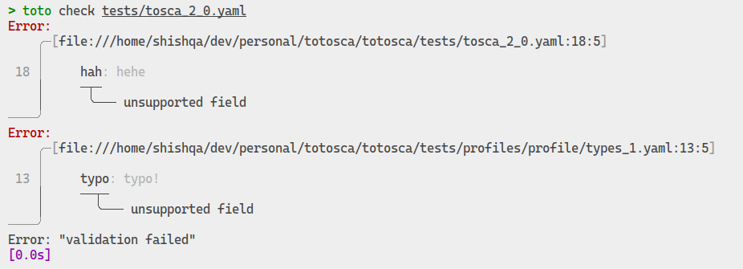
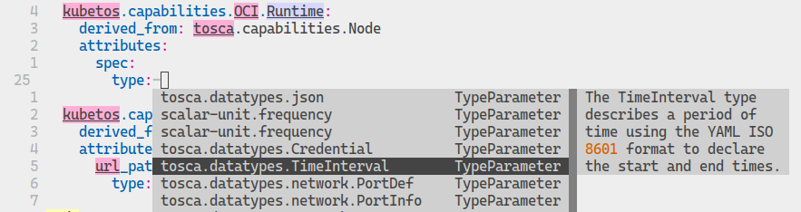

# totosca

<p align="center">
    
</p>

## What is this?

**totosca** is a set of tools aimed to help you working with [OASIS TOSCA](https://github.com/oasis-tcs/tosca-specs/blob/working/tosca_2_0/TOSCA-v2.0.md) language.

> pronounce: [**totoshka**](https://translate.google.com/?sl=ru&tl=en&text=%D1%82%D0%BE%D1%82%D0%BE%D1%88%D0%BA%D0%B0&op=translate) or **toto**: https://ru.wikipedia.org/wiki/Тотошка

This includes:
- `toto check` --- validation tool, that reports issues in TOSCA files.

    

- `toto ls` --- an implementation of the [LSP](https://microsoft.github.io/language-server-protocol/) server for TOSCA.

   

### How to try?

1. Install `toto` CLI with cargo:
    ```bash
    cargo install --git https://github.com/Shishqa/totosca toto_cli
    ```
1. Validate your template with `toto check your_template.yaml`
1. Continue with installing one of the available [integrations](./integrations/):
    - [totosca.nvim](./integrations/nvim/) - neovim plugin for `toto ls` support
    - [totosca.vscode](./integrations/vscode/) - vscode extension for `toto ls` support

## Current state

**Work in progress**: see [TODO.md](./TODO.md) (Some notes can be found in [docs](./docs))

**Warning**: significant code modifications are possible!

This project is now developed solely by @Shishqa as a side hustle. My motivation to work
on this project is to contribute to the TOSCA ecosystem and promote the adoption of this
standard across organizations simply because I appreciate the direction TOSCA is taking.

## Design

The project was inspired by the following projects (**check them out 💖!**):

- https://github.com/tliron/puccini
- https://github.com/emk/compose_yml
- https://github.com/faradayio/openapi-interfaces

### Goals

- **Be as close to the TOSCA standard as possible** (large lags can happen, since this is not my main activity).
- **Be as handy as possible**: TOSCA is complex, there is certainly no need to complicate the tools.
- **Be as transparent as possible**: if something breaks in the tools, it should be clear 1) where, 2) what, and 3) how to reproduce the issue.

### Non-goals

- **Be blazingly fast**: I am not a professional rust developer (but adore rust), so I'm not shy about using `.clone()`, `.to_string()`, and linear searches.
    As long as the work speed is acceptable, it's fine.

### Roadmap

- [x] Provide MVP tools to work with TOSCA language: `toto check` and `toto ls`
- [ ] ~100% TOSCA coverage: battle-tested on various templates, covered with tests
- [ ] Stable API: allow totosca to be embedded into other systems, that need to process TOSCA models and working
    with the TOSCA graph.
- [ ] Implement writing YAML files back: formatting, import collapsing, making implicit decisions explicit

to be continued...
